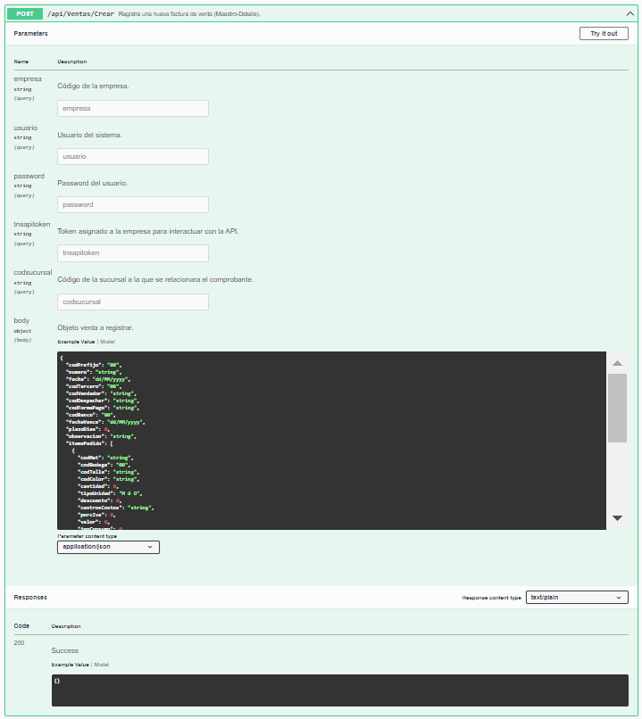
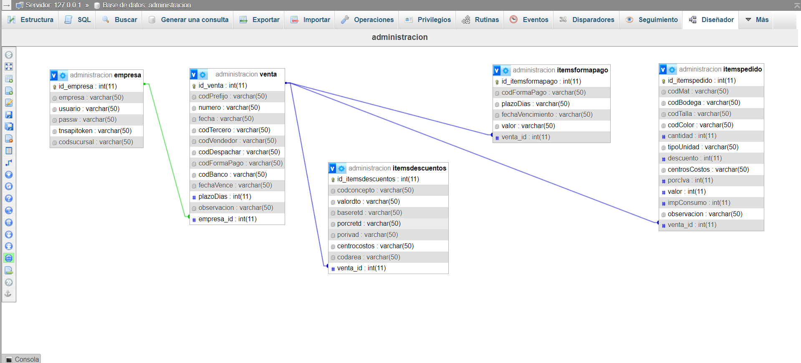

# ETL - Integración B2B (Empresa - TNS)
Proyecto base para crear microservicios de integración con TNS.


https://api.tns.co/index.html#operations-Ventas-post_api_Ventas_Crear


## Documentación técnica

### Proceso de creación de una venta con TNS.

```CMD
{
  "codPrefijo": "00",
  "numero": "string",
  "fecha": "dd/MM/yyyy",
  "codTercero": "00",
  "codVendedor": "string",
  "codDespachar": "string",
  "codFormaPago": "string",
  "codBanco": "00",
  "fechaVence": "dd/MM/yyyy",
  "plazoDias": 0,
  "observacion": "string",
  "itemsPedido": [
    {
      "codMat": "string",
      "codBodega": "00",
      "codTalla": "string",
      "codColor": "string",
      "cantidad": 0,
      "tipoUnidad": "M ó D",
      "descuento": 0,
      "centrosCostos": "string",
      "porcIva": 0,
      "valor": 0,
      "impConsumo": 0,
      "observacion": "string"
    }
  ],
  "itemsFormaPago": [
    {
      "codFormaPago": "string",
      "plazoDias": "string",
      "fechaVencimiento": "string",
      "valor": "string"
    }
  ],
  "itemsDescuentos": [
    {
      "codconcepto": "string",
      "valordto": "string",
      "baseretd": "0",
      "porcretd": "0",
      "porivad": "0",
      "centrocostos": "00",
      "codarea": "00"
    }
  ]
}
```

El diseño mínimo de una base de datos compatible sería:


El código SQL está en la carpeta:
> ./bbdd/administracion.sql

```SQL
CREATE DATABASE IF NOT EXISTS administracion;

CREATE TABLE IF NOT EXISTS administracion.empresa (
  id_empresa int(11) AUTO_INCREMENT PRIMARY KEY,
  empresa varchar(50) DEFAULT NULL,
  usuario varchar(50) DEFAULT NULL,
  passw varchar(50) DEFAULT NULL,
  tnsapitoken varchar(50) DEFAULT NULL,
  codsucursal varchar(50) DEFAULT NULL
);

CREATE TABLE IF NOT EXISTS administracion.itemsdescuentos (
  id_itemsdescuentos int(11) AUTO_INCREMENT PRIMARY KEY,
  codconcepto varchar(50) DEFAULT NULL,
  valordto varchar(50) DEFAULT NULL,
  baseretd varchar(50) DEFAULT NULL,
  porcretd varchar(50) DEFAULT NULL,
  porivad varchar(50) DEFAULT NULL,
  centrocostos varchar(50) DEFAULT NULL,
  codarea varchar(50) DEFAULT NULL,
  venta_id int(11) NOT NULL
);

CREATE TABLE IF NOT EXISTS administracion.itemsformapago (
  id_itemsformapago int(11) AUTO_INCREMENT PRIMARY KEY,
  codFormaPago varchar(50) DEFAULT NULL,
  plazoDias varchar(50) DEFAULT NULL,
  fechaVencimiento varchar(50) DEFAULT NULL,
  valor varchar(50) DEFAULT NULL,
  venta_id int(11) NOT NULL
);

CREATE TABLE IF NOT EXISTS administracion.itemspedido (
  id_itemspedido int(11) AUTO_INCREMENT PRIMARY KEY,
  codMat varchar(50) DEFAULT NULL,
  codBodega varchar(50) DEFAULT NULL,
  codTalla varchar(50) DEFAULT NULL,
  codColor varchar(50) DEFAULT NULL,
  cantidad int(11) DEFAULT NULL,
  tipoUnidad varchar(50) DEFAULT NULL,
  descuento int(11) DEFAULT NULL,
  centrosCostos varchar(50) DEFAULT NULL,
  porcIva int(11) DEFAULT NULL,
  valor int(11) DEFAULT NULL,
  impConsumo int(11) DEFAULT NULL,
  observacion varchar(50) DEFAULT NULL,
  venta_id int(11) NOT NULL
);

CREATE TABLE IF NOT EXISTS administracion.venta (
  id_venta int(11) AUTO_INCREMENT PRIMARY KEY,
  codPrefijo varchar(50) DEFAULT NULL,
  numero varchar(50) DEFAULT NULL,
  fecha varchar(50) DEFAULT NULL,
  codTercero varchar(50) DEFAULT NULL,
  codVendedor varchar(50) DEFAULT NULL,
  codDespachar varchar(50) DEFAULT NULL,
  codFormaPago varchar(50) DEFAULT NULL,
  codBanco varchar(50) DEFAULT NULL,
  fechaVence varchar(50) DEFAULT NULL,
  plazoDias int(11) DEFAULT NULL,
  observacion varchar(50) DEFAULT NULL,
  empresa_id int(11) NOT NULL
);

CREATE OR REPLACE VIEW administracion.view_venta AS
SELECT id_venta,
codPrefijo,
numero,
fecha,
codTercero,
codVendedor,
codDespachar,
codFormaPago,
codBanco,
fechaVence,
plazoDias,
observacion,
empresa_id 
FROM administracion.venta;

CREATE OR REPLACE VIEW administracion.view_empresa AS
SELECT
id_empresa,
empresa,
usuario,
passw,
tnsapitoken,
codsucursal
FROM administracion.empresa;

CREATE OR REPLACE VIEW administracion.view_itemspedido AS
SELECT
id_itemspedido,
codMat,
codBodega,
codTalla,
codColor,
cantidad,
tipoUnidad,
descuento,
centrosCostos,
porcIva,
valor,
impConsumo,
observacion,
venta_id
FROM administracion.itemspedido;

CREATE OR REPLACE VIEW administracion.view_itemsdescuentos AS
SELECT 
id_itemsdescuentos,
codconcepto,
valordto,
baseretd,
porcretd,
porivad,
centrocostos,
codarea,
venta_id
FROM administracion.itemsdescuentos;

CREATE OR REPLACE VIEW administracion.view_itemsformapago AS
SELECT
id_itemsformapago,
codFormaPago,
plazoDias,
fechaVencimiento,
valor,
venta_id 
FROM administracion.itemsformapago;
```

### Acceso a la base de datos
Se debe gestionar la configuración de acceso a la base de datos MySQL.  
./app/model/Connector/Connector.py
```Python
class Connector(CoreAbstractConnector):

    ...

    def __secret(self):
        # Como buena práctica se aconseja siempre crear un método secreto para gestionar las credenciales de acceso al servidor.
        self.__host="localhost"
        self.__user="root"
        self.__password=""
    ...
```

### Configuración del entorno de desarrollo.
| Paso   | Descripción                       | comando                             |
| :----  | :----                             | :---                                |
| Paso 1 |  Crear el entorno de trabajo.     | python -m venv env                  |
| Paso 2 | Activar el entorno de trabajo.    | ./env/Scripts/activate              |
| Paso 3 | Actualizar el gestor de paquetes. | python -m pip install --upgrade pip |
| Paso 4 | Prepare la receta de librerías.   | pip install -r requirements.txt     |

### Librerías del proyecto.
| librería | Descripción | Comando |
| :----    | :---        | :---    |
| mysql-connector | Permite el acceso a una base de datos mysql | python -m pip install mysql-connector |
| requests | Permite acceder a APIs | python -m pip install requests |


### Demo
Muy simple, para ejecutar el archivo main. (py main.py).  
Primero tienes que tener una cuenta con TNS.

```python

import json
import requests
from app.controller.ControllerEmpresa.ControllerEmpresa import ControllerEmpresa
from app.controller.ControllerItemsFormaPago.ControllerItemsFormaPago import ControllerItemsFormaPago
from app.controller.ControllerItemsPedido.ControllerItemsPedido import ControllerItemsPedido
from app.controller.ControllerVenta.ControllerVenta import ControllerVenta

controllerEmpresa = ControllerEmpresa()
empresas = json.loads(controllerEmpresa.controller("3"))

response = []
for empresa in empresas:
    empresaNombre = empresa['empresa']
    usuario = empresa['usuario']
    password = empresa['password']
    tnsapitoken = empresa['tnsapitoken']
    codsucursal = empresa['codsucursal']    
    controllerItemsPedido = ControllerVenta()
    ventas = json.loads(controllerItemsPedido.controller(empresa['id_empresa']))
    sells = []
    for venta in ventas:
        sell = {}
        sell['codPrefijo'] = venta['codPrefijo']
        sell['fecha'] = venta['fecha']
        sell['codTercero'] = venta['codTercero']
        sell['codVendedor'] = venta['codVendedor']
        sell['codDespachar'] = venta['codDespachar']
        sell['codFormaPago'] = venta['codFormaPago']
        sell['codBanco'] = venta['codBanco']
        sell['fechaVence'] = venta['fechaVence']
        sell['plazoDias'] = venta['plazoDias']
        sell['observacion'] = venta['observacion']
        sell['itemsPedido'] = []
        sell['itemsFormaPago'] = []
        controllerItemsPedido = ControllerItemsPedido()
        sell['itemsPedido'] = json.loads(controllerItemsPedido.controller(venta['id_venta']))
        controllerItemsPedido = ControllerItemsFormaPago()
        sell['itemsFormaPago'] = json.loads(controllerItemsPedido.controller(venta['id_venta']))
        
        url = "https://api.tns.co/api/Ventas/Crear?"
        url+="empresa="+empresaNombre
        url+="&usuario="+usuario
        url+="&password="+password
        url+="&tnsapitoken="+tnsapitoken
        url+="&codsucursal="+codsucursal

        r = requests.post(url, json=sell)
        #print(r.status_code)
        response.append(r.json())
        sells.append(sell)

controllerEmpresa.writeFile("./data/respuestasTNS.json",json.dumps(response,indent=4))
print(json.dumps(sells,indent=4))

```  


#### Actualizar la receta.
Si agregas nuevas librerías al proyecto, no olvides actualizar la receta.

``` CMD
pip freeze > requirements.txt
```

---

#### Comprobar que todo está en orden.
| Paso   | Descripción                                   | comando                               |
| :----  | :----                                         | :---                                  |
| Paso 1 | Desactive el entorno de trabajo.              | deactivate                            |
| Paso 2 | Elimine el entorno anterior.                  | rm -R env                             |
| Paso 3 | Cree un entorno de python.                    | python -m venv env                    |
| Paso 4 | Active el entorno de trabajo.                 | ./env/Scripts/activate                |
| Paso 5 | Actualice el gestor de paquetes.              | python -m pip install --upgrade pip   |
| Paso 6 | Instale las librerías necesarias para operar. | pip install -r requirements.txt       |
| Paso 7 | Realice pruebas de rutina.                    | py main.py |
| Paso 8 | Finalice su gestión.                          | deactivate                            |

